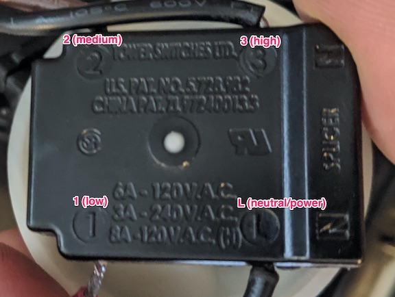

# Fanpi

This provides a simple web ui for controlling a fan from a Raspberry Pi. The inspiration for this was the [DIY KICKR HEADWIND (HRM CONTROLLED FAN)](https://www.youtube.com/watch?v=6tJlJQgutkI), but I didn't really want to do the automatic controls, and I wanted to use the Pi I had.

The app is a simple Python Flask app.

## Electrical description for non-experts

The general setup is the web UI controls trigger the output pins on the Pi, triggering the appropriate relay on the Pi, sending 120v to the appropriate wires in the fan, speeding it up or down. Originally I was hoping to be able to do a fully variable fan speed, but the way these fans are wired doesn't actually allow for that (at least trivially to me).

The DIY Headwind video explains the wiring, but my simple explanation is the fan switch has power come in, and then can output to one of 3 different wires. Those wires connect to the fan, controlling how strong it goes.



To control the fan it's then a relatively simple manner of sending the input 120v AC down the appropriate wire, which is how the relay comes into play. The relay is basically a signal controlled switch. You power up the controls through the input/ground connection. You then send the Pi's GPIO output signal to one of the inputs to cause it to send voltage out the corresponding connection.

For a schematic diagram of how to wire the relay look at the [DIY Headwind's guide](https://www.andrewgrabbs.com/interests/cycling/diy-kickr-headwind-smart-fan/). Generally, connect the center of each relay together, then connect the line from the 120v input to that (tying them all together). By default we'd want the fan to be off, so we connect the wires from the fan to the default _open_ side of the relay.


## Building the electronics

Required Components:
* some sort of controllable fan with multiple settings
    * having tried multiple types of fan, I recommend a blower fan ([eg a Stanley fan at Ace Hardware](https://www.acehardware.com/departments/heating-and-cooling/portable-and-exhaust-fans/household-fans/6104947))
* Raspberry Pi (version doesn't really matter)
* a 5V relay with at least as many channels as you have fan settings
    * for a standard off/low/medium/high fan you need 3 channels
    * for example [JBtek 4 channel on Amazon](https://www.amazon.com/JBtek-Channel-Module-Arduino-Raspberry/dp/B00KTEN3TM)
* some jumper wires for Pi to Relay connections
* some wire for connecting the relay channels together
* a power connection for your Pi (eg a usb cord + usb power adapter)
* a network connection for your Pi (an ethernet connection or a Pi with wifi or a wifi adapter)

## Install on Raspberry Pi

```shell
# Install docker
$ curl -fsSL https://get.docker.com -o get-docker.sh
$ sudo sh get-docker.sh
# Allow the pi user to run docker containers
$ sudo usermod -aG docker pi
# TODO: define how to run this image

```

## App setup for local development

The App is a Python Flask app.

```shell
$ pip install -r requirements.txt
```
